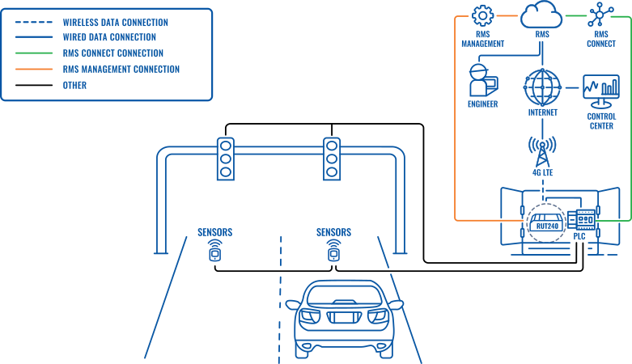

# Traffic-light-management-system
this monorepo contains the simalutions of a smart traffics management algoritm for low complexity SDNs

## Project Checklist

### Setup and Installation

- [ ] **Install and Configure Mininet:**
  - [ ] Download and install Mininet.
  - [ ] Verify basic Mininet functionality with a simple network topology.

- [ ] **Install SUMO:**
  - [ ] Download and install the SUMO simulator.
  - [ ] Verify SUMO installation with a basic traffic simulation.

- [ ] **Install HP VAN SDN Controller:**
  - [ ] Download and install the HP VAN SDN Controller.
  - [ ] Configure the controller and ensure it's running.

### Network Virtualization with Mininet

- [ ] **Define Network Topology:**
  - [ ] Create a Mininet script to define the virtual network topology.
  - [ ] Include OpenFlow-enabled switches in the topology.

- [ ] **Connect Mininet Topology to HP VAN SDN Controller:**
  - [ ] Configure OpenFlow switches in Mininet to connect to the HP VAN SDN Controller.
  - [ ] Verify successful communication between Mininet and the controller.

- [ ] **Test Network Scenarios:**
  - [ ] Implement different network scenarios in Mininet to simulate various conditions.
  - [ ] Verify that the virtual network behaves as expected.

### Traffic Simulation with SUMO

- [ ] **Create SUMO Scenario:**
  - [ ] Define a SUMO scenario representing the traffic conditions for your project.
  - [ ] Simulate realistic traffic patterns and conditions.

- [ ] **Implement TraCI Interface:**
  - [ ] Develop a component to establish communication between SUMO and the HP VAN SDN Controller using the TraCI interface.
  - [ ] Ensure bidirectional communication for real-time updates.

- [ ] **Integrate SUMO with HP VAN SDN Controller:**
  - [ ] Implement logic in the HP VAN SDN Controller to receive and process traffic simulation data from SUMO.
  - [ ] Test the integration under various simulated traffic conditions.

### SDN Controller Logic

- [ ] **Develop SDN Controller Logic:**
  - [ ] Program rules for traffic management based on the information received from both Mininet and SUMO.
  - [ ] Implement dynamic decision-making based on real-time traffic conditions.

- [ ] **Synchronize Time:**
  - [ ] Establish a synchronization mechanism to align the timing of SDN decisions with the simulated traffic conditions.

- [ ] **Test and Validate:**
  - [ ] Conduct extensive testing to validate the effectiveness of the SDN controller's decisions in response to varying network and traffic scenarios.

### Optimization and Refinement

- [ ] **Optimize Rules and Algorithms:**
  - [ ] Analyze performance metrics and optimize rule sets and algorithms based on simulation and virtual network testing.

- [ ] **Monitor and Adapt:**
  - [ ] Implement monitoring mechanisms for real-time performance tracking.
  - [ ] Be prepared to adapt the system based on test results and changing requirements.

### Documentation and Reporting

- [ ] **Document Architecture and Implementation:**
  - [ ] Create comprehensive documentation for the system architecture, components, and implementations.

- [ ] **Generate Reports:**
  - [ ] Generate reports summarizing the results of testing, optimization, and any challenges encountered during the development process.

### Final Testing and Deployment

- [ ] **Final Integration Testing:**
  - [ ] Conduct final integration tests with the complete system, including Mininet, SUMO, and the HP VAN SDN Controller.

- [ ] **Deployment Planning:**
  - [ ] Plan the deployment strategy for the system, considering any specific requirements for the target environment.

- [ ] **Rollout:**
  - [ ] Deploy the system in the target environment, ensuring smooth integration and performance.

<!-- <table>
  <tr>
    <th>Technical Specifications</th>
    <th>Model Name</th>
    <th>Image</th>
  </tr>
  <tr>
    <td style="font-size: smaller;">
      <b>1. LED Brightness:</b> 
      
&bull; Red LED: 4000-5000mcd brightness.

      
&bull; Yellow LED: 4000-5000mcd brightness.

      
&bull; Green LED: 7000-9500mcd brightness.

      <b>2. LED Features:</b> 
      
&bull; LED is a stable light source with an ideal display effect.

      <b>3. Waterproof Design:</b> 
      
&bull; Durable black housing ensures longevity.

      
&bull; Multilayer seal protects the lens from dust and water.

      
&bull; Waterproof grade: IP65.

      <b>4. Construction:</b> 
      
&bull; Clear lens for high penetrability.

      
&bull; Fire-resistant and Anti-UV properties.

      <b>5. Module Dimensions:</b> 
      
&bull; Diameter: Approximately 299 mm (12 inches).

      <b>6. Operating Voltage:</b> 
      
&bull; DC9-36V or 85V-265VA.

    </td>
    <td style="font-size: smaller;"><b>200 mm LED traffic light</b></td>
    <td></td>
  </tr>
</table> -->

