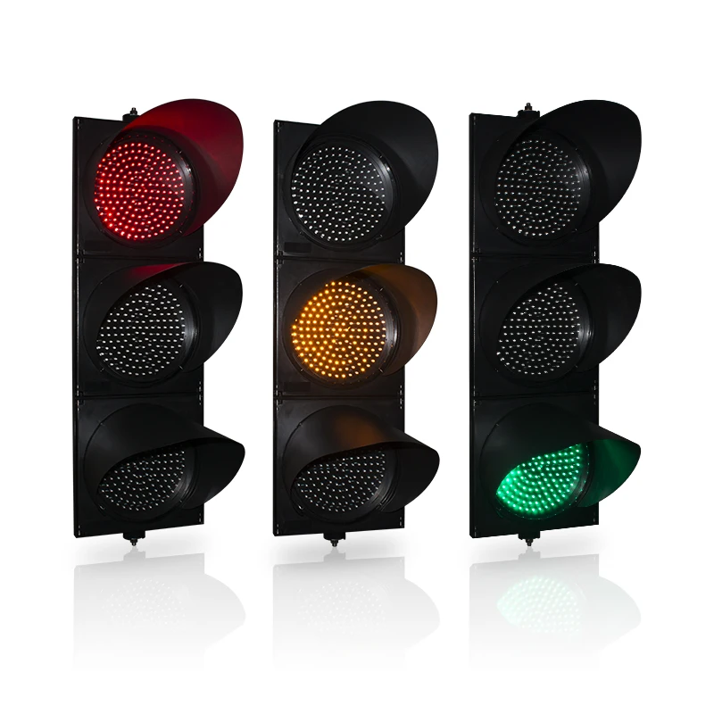

# Traffic-light-management-system
## Traffic Simulator

Traffic simulator implemented in C++

credits Project template to : <https://github.com/lutrarutra/SFML-Project-Template>

<table>
  <tr>
    <th>Technical Specifications</th>
    <th>Model Name</th>
    <th>Image</th>
  </tr>
  <tr>
    <td style="font-size: smaller;">
      <b>1. LED Brightness:</b> 
      
&bull; Red LED: 4000-5000mcd brightness.

      
&bull; Yellow LED: 4000-5000mcd brightness.

      
&bull; Green LED: 7000-9500mcd brightness.

      <b>2. LED Features:</b> 
      
&bull; LED is a stable light source with an ideal display effect.

      <b>3. Waterproof Design:</b> 
      
&bull; Durable black housing ensures longevity.

      
&bull; Multilayer seal protects the lens from dust and water.

      
&bull; Waterproof grade: IP65.

      <b>4. Construction:</b> 
      
&bull; Clear lens for high penetrability.

      
&bull; Fire-resistant and Anti-UV properties.

      <b>5. Module Dimensions:</b> 
      
&bull; Diameter: Approximately 299 mm (12 inches).

      <b>6. Operating Voltage:</b> 
      
&bull; DC9-36V or 85V-265VA.

    </td>
    <td style="font-size: smaller;"><b>200 mm LED traffic light</b></td>
    <td></td>
  </tr>
</table>

